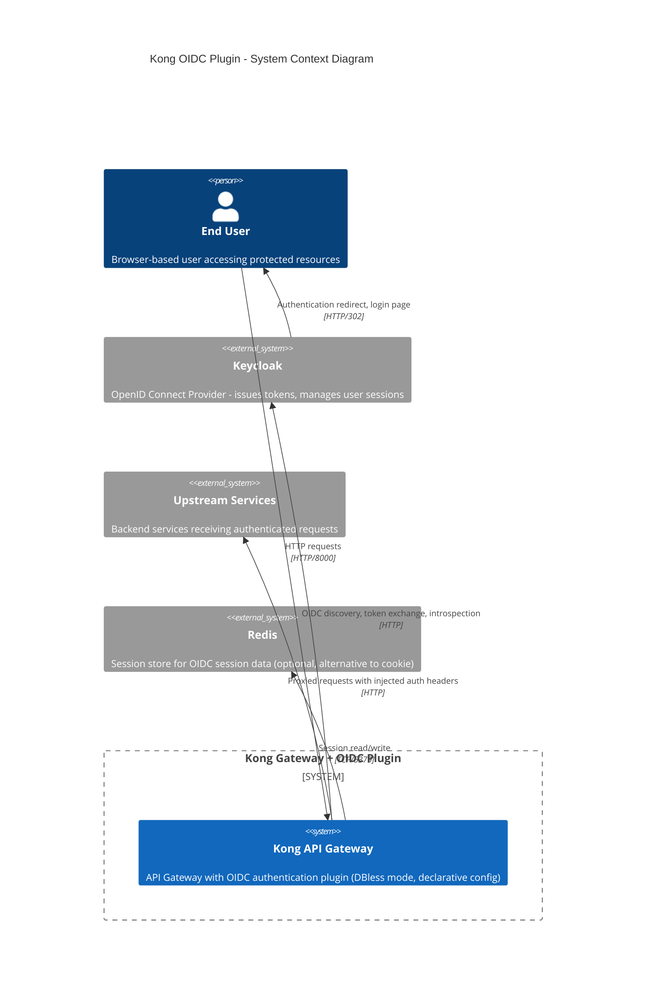
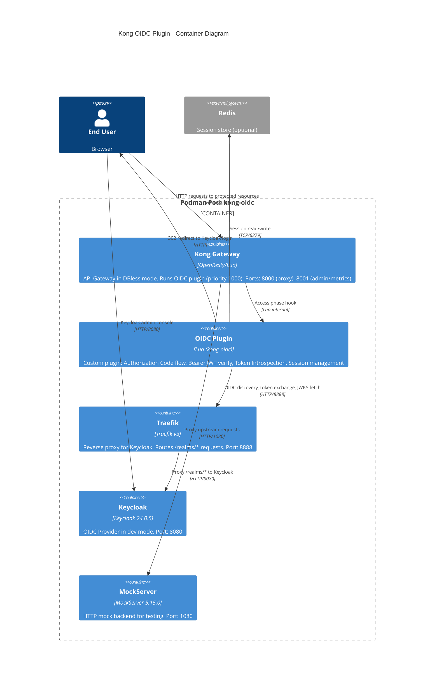
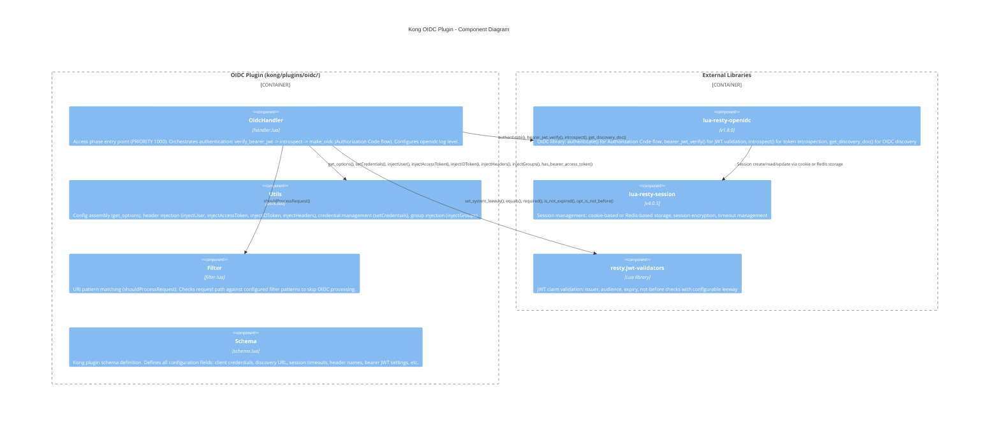
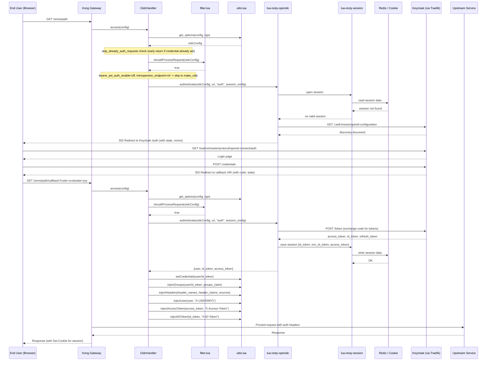
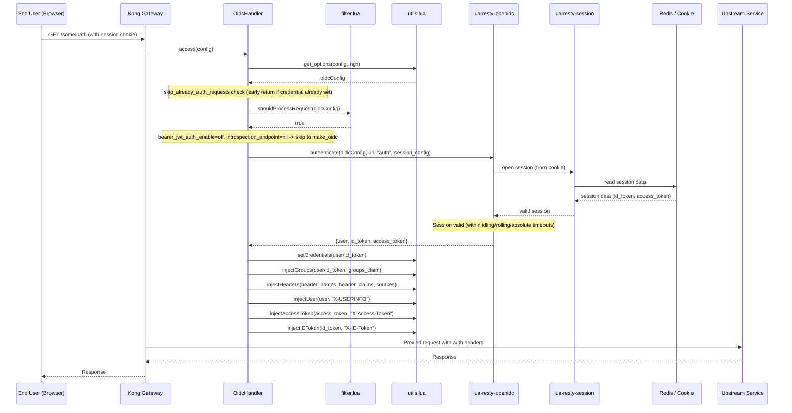
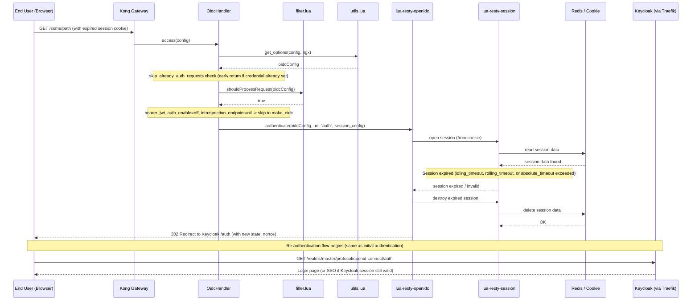
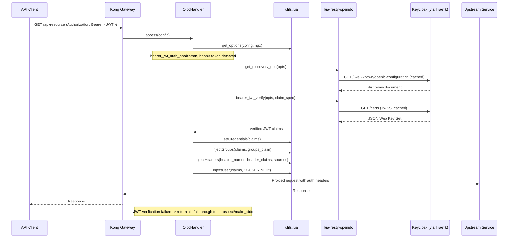
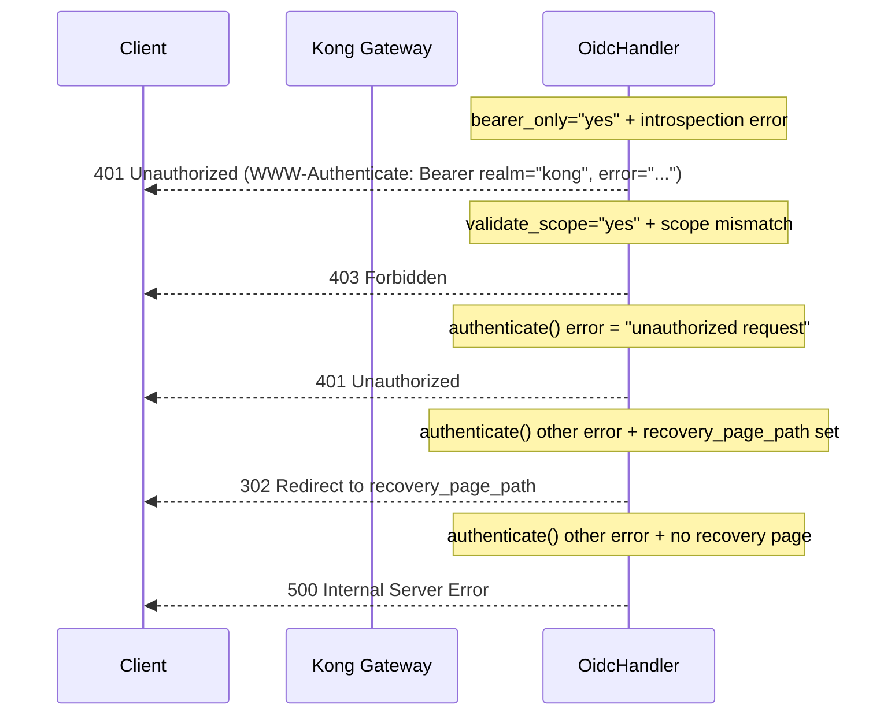

# Kong OIDC Plugin - C4 Model Architecture

## 1. コンテキスト図 (Context Diagram)

システム全体の境界と外部アクターの関係を示す。Kong Gateway と OIDC Plugin をシステム境界とし、外部のユーザー、認証プロバイダ、上流サービス、セッションストアとの関係を表現する。

## 2. コンテナ図 (Container Diagram)

インフラストラクチャを構成するコンテナ間の通信とポート、プロトコルを示す。全コンテナは Podman Pod 内で動作し、Pod 内ネットワーク (localhost) で通信する。

## 3. コンポーネント図 (Component Diagram)

OIDC Plugin の内部構造を示す。各 Lua モジュールの責務と、外部ライブラリとの依存関係を表現する。

## 4. シーケンス図 (Sequence Diagrams)

以下のシーケンス図では、`lua-resty-openidc` 内部の動作（セッション操作、ディスカバリ取得、リダイレクト生成、コード交換等）はライブラリ委譲された処理として記載している。プラグインコードが直接実装しているのは `resty.openidc.authenticate()` / `bearer_jwt_verify()` / `introspect()` / `get_discovery_doc()` の呼び出しまでである。

### 4a. 初回認証フロー (Authorization Code Flow)

ユーザーが初めてアクセスした場合の認証フロー。セッションが存在しないため、Keycloak にリダイレクトして認証後、コールバックでトークンを取得し、セッションを保存する。

### 4b. 認証済みリクエストフロー (Authenticated Request with Valid Session)

既に認証済みのユーザーがセッション Cookie を持ってアクセスする場合のフロー。セッションが有効であれば、認証プロバイダへの通信なしにリクエストを処理する。

### 4c. セッション期限切れフロー (Session Expired Flow)

セッションが期限切れまたは無効になった場合のフロー。再認証のために Keycloak にリダイレクトされる。

### 4d. Bearer JWT 認証フロー

`bearer_jwt_auth_enable` が有効な場合、Authorization ヘッダーの Bearer トークンを JWKS で検証する。セッション不要で、Keycloak へのリダイレクトは発生しない。

### 4e. エラーフロー

認証失敗時のレスポンス分岐を示す。

