# Kong OIDC Plugin - Architecture

## 1. コンテキスト図 (Context Diagram)

システム全体の境界と外部アクターの関係を示す。Kong Gateway + OIDC Plugin をシステム境界とし、外部のユーザー、認証プロバイダ、上流サービス、セッションストアとの通信フローを表現する。

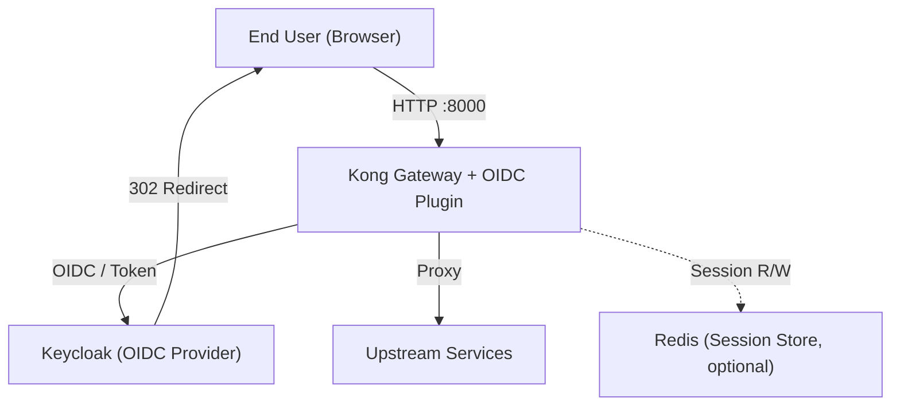

## 2. コンテナ図 (Container Diagram)

Podman Pod 内のコンテナ配置とルーティングを示す。Kong はリクエストを受け付け、認証時は Traefik 経由で Keycloak と通信し、認証後は MockServer（バックエンド）へプロキシする。

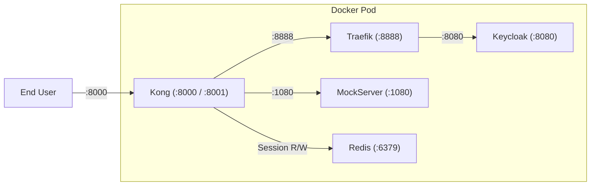

### 2.1. コンテナ間シーケンス図

コンテナ図の構成要素を participant として、主要な認証フローをまとめて示す。

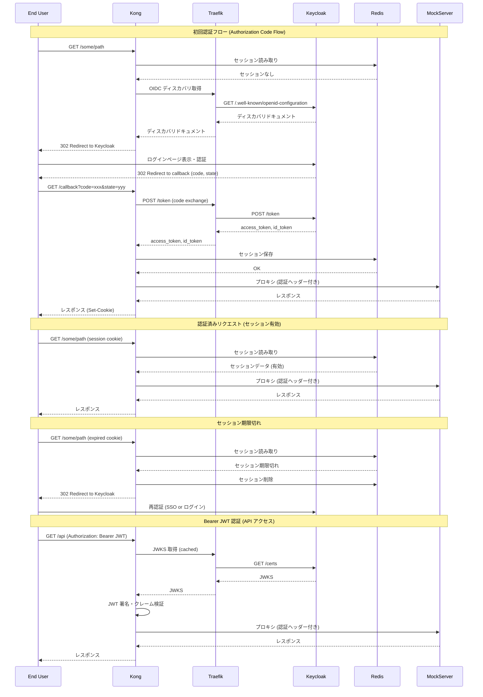

## 3. コンポーネント図 (Component Diagram)

OIDC Plugin を構成する Lua モジュールと外部ライブラリの依存関係を示す。handler.lua がエントリポイントとなり、認証処理を統括する。

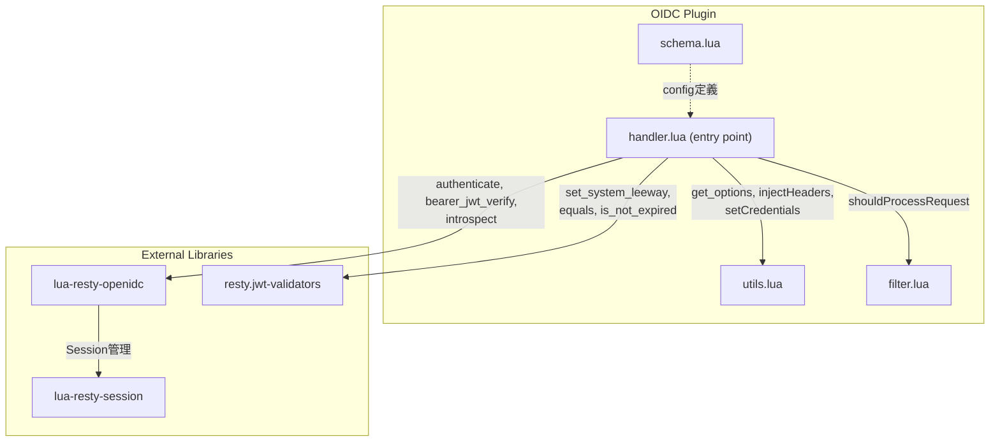

## 4. シーケンス図 (Sequence Diagrams)

以下のシーケンス図では、`lua-resty-openidc` 内部の動作（セッション操作、ディスカバリ取得、リダイレクト生成、コード交換等）はライブラリ委譲された処理として記載している。プラグインコードが直接実装しているのは `resty.openidc.authenticate()` / `bearer_jwt_verify()` / `introspect()` / `get_discovery_doc()` の呼び出しまでである。

### 4a. 初回認証フロー (Authorization Code Flow)

ユーザーが初めてアクセスした場合の認証フロー。セッションが存在しないため、Keycloak にリダイレクトして認証後、コールバックでトークンを取得し、セッションを保存する。

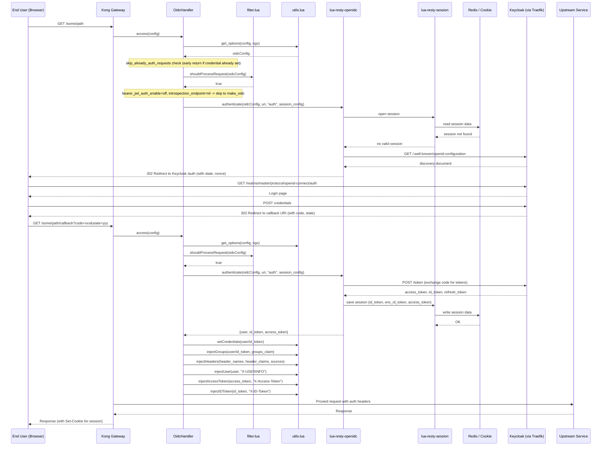

### 4b. 認証済みリクエストフロー (Authenticated Request with Valid Session)

既に認証済みのユーザーがセッション Cookie を持ってアクセスする場合のフロー。セッションが有効であれば、認証プロバイダへの通信なしにリクエストを処理する。

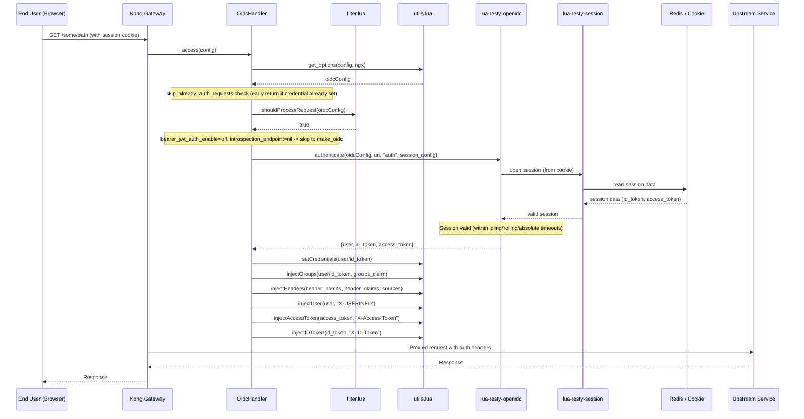

### 4c. セッション期限切れフロー (Session Expired Flow)

セッションが期限切れまたは無効になった場合のフロー。再認証のために Keycloak にリダイレクトされる。

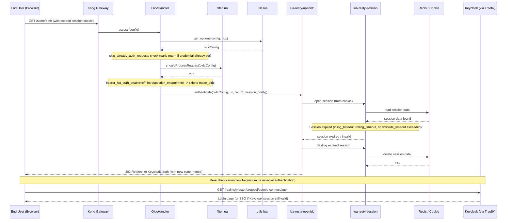

### 4d. Bearer JWT 認証フロー

`bearer_jwt_auth_enable` が有効な場合、Authorization ヘッダーの Bearer トークンを JWKS で検証する。セッション不要で、Keycloak へのリダイレクトは発生しない。

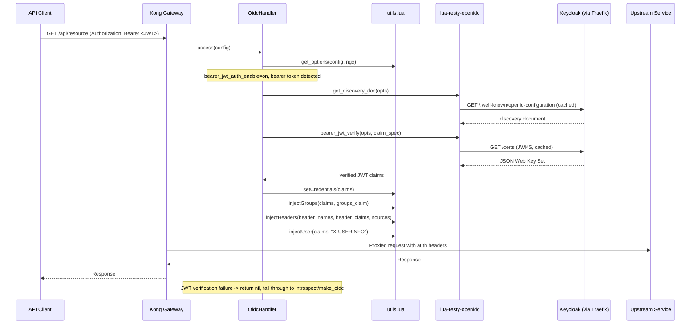

### 4e. エラーフロー

認証失敗時のレスポンス分岐を示す。

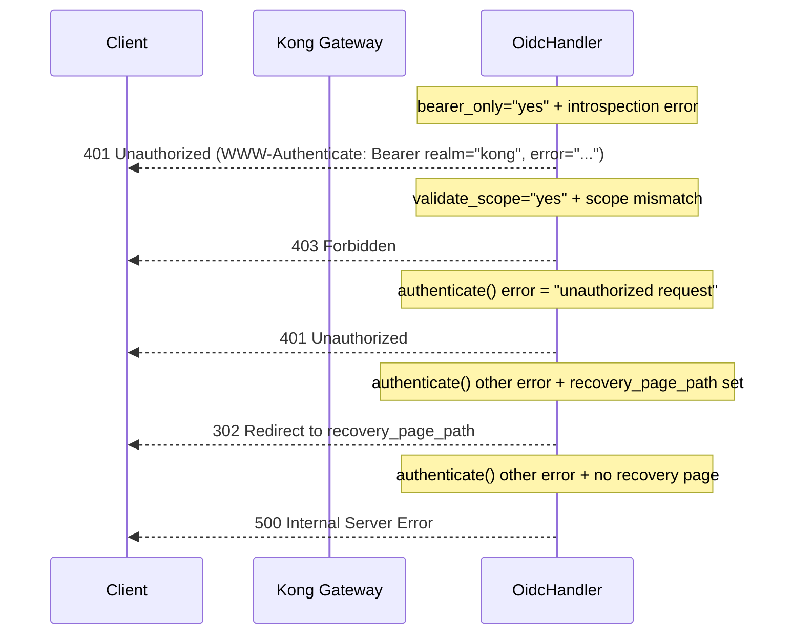

## 5. データモデル (Data Model)

### 5.1. 概念データモデル

プラグイン内で扱う主要なデータ概念とその関係を示す。

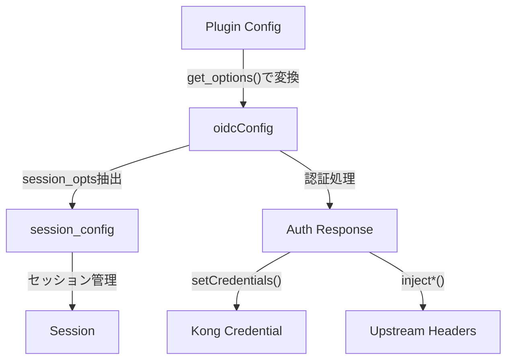

| 要素 | 説明 |
|------|------|
| Plugin Config | Kong の宣言的設定（`kong.yml`）または Admin API から渡されるプラグイン設定。`schema.lua` で定義 |
| oidcConfig | `utils.get_options()` で Plugin Config から変換された実行時設定。文字列の `"yes"/"no"` を boolean に変換し、フィルタパターンをパース済み |
| session_config | `make_oidc()` で oidcConfig から抽出されたセッション設定。Cookie 名、暗号化シークレット、タイムアウト、Redis 接続情報を含む |
| Session | `lua-resty-session` が管理するセッションデータ。Cookie または Redis に暗号化して保存。`session_contents` で保存対象を制御（id_token, enc_id_token, access_token） |
| Auth Response | `lua-resty-openidc` の認証結果。認証方式により構造が異なる（Authorization Code: user + id_token + access_token、Bearer JWT / Introspection: トークンクレーム直接） |
| Kong Credential | `setCredentials()` で設定される Kong 認証情報。`sub` → `id`、`preferred_username` → `username` にマッピングし、`kong.client.authenticate()` に渡す |
| Upstream Headers | バックエンドに注入される認証ヘッダー。`X-USERINFO`（Base64）、`X-Access-Token`、`X-ID-Token`（Base64）、および `header_names`/`header_claims` で定義されたカスタムヘッダー |

### 5.2. 論理データモデル

各データ概念の主要な属性をクラス図で示す。

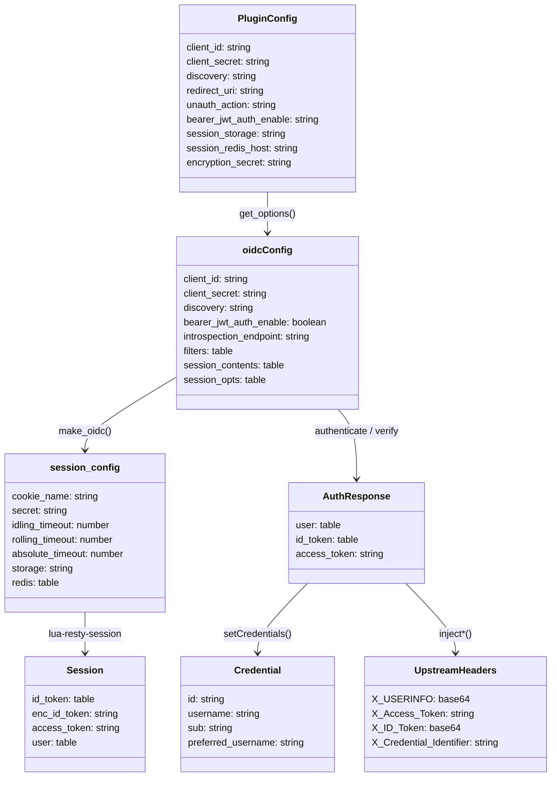

### 5.3. データフロー

概念データモデル上でのデータの流れを、認証フェーズごとに示す。

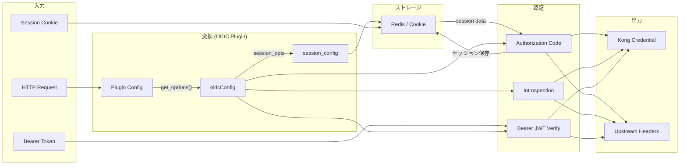
