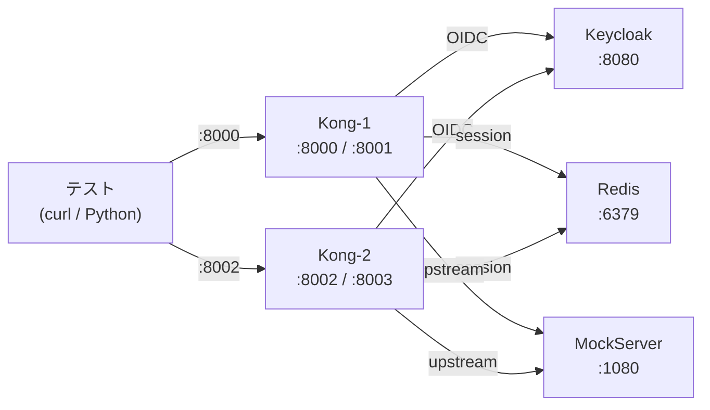

# E2E テスト

Kong + Keycloak + Redis + MockServer(upstream) で OIDC プラグインの Redis セッション動作を検証する。

## テストケース一覧

### Redis セッション検証

| ID | テスト | 検証方法 |
|----|--------|---------|
| E2E-01 | Access Token 有効期限 60 秒 | Keycloak realm 設定確認（accessTokenLifespan=60） |
| E2E-02 | Plugin config 確認 | Kong Admin API で session_storage/timeout 値確認 |
| E2E-03 | Redis セッション保存 | Auth Code フロー後、Redis に DBSIZE > 0 + TTL 確認 |
| E2E-04 | Cookie サイズ（session ID のみ） | Cookie が 200 バイト未満 |

### マルチノード検証

| ID | テスト | 検証方法 |
|----|--------|---------|
| E2E-05 | Kong 2 台でのセッション共有 | Kong-1 でログイン → Kong-2 に同じ Cookie でセッション有効 |

## 実行方法

```bash
# 全テスト実行（Docker Compose 起動 -> Keycloak セットアップ -> テスト -> 停止）
bash spec/e2e/run-e2e.sh

# テストケース一覧のみ表示
bash spec/e2e/run-e2e.sh --list

# 個別実行（事前に Docker Compose + Keycloak セットアップが必要）
docker compose -f spec/e2e/docker-compose.e2e.yml up -d --build
# 全サービス起動待ち
timeout 120 bash -c 'until curl -sf http://localhost:8001/status > /dev/null 2>&1; do sleep 2; done'
timeout 120 bash -c 'until curl -sf http://localhost:8080/health/ready > /dev/null 2>&1; do sleep 3; done'
bash spec/e2e/keycloak-setup.sh
bash spec/e2e/tests/verify-redis-session.sh
bash spec/e2e/tests/verify-multi-node.sh
docker compose -f spec/e2e/docker-compose.e2e.yml down
```

## 前提条件

- Docker Desktop が稼働していること
- Python 3 + requests + beautifulsoup4
  ```bash
  pip install requests beautifulsoup4
  ```
- ポート 8000-8003, 8080, 1080, 6379 が未使用であること

## インフラ構成



## 手動確認手順（CLI）

ブラウザからの手動テストは `KC_HOSTNAME_URL=http://keycloak:8080` の設定により、
OIDC リダイレクト先が Docker 内部ホスト名になるため不可。
自動テスト (`run-e2e.sh`) の Python ヘルパーが URL を `localhost:8080` に書き換えて対処している。

CLI での個別確認:

```bash
# サービス起動 + セットアップ
docker compose -f spec/e2e/docker-compose.e2e.yml up -d --build
timeout 120 bash -c 'until curl -sf http://localhost:8001/status > /dev/null 2>&1; do sleep 2; done'
timeout 120 bash -c 'until curl -sf http://localhost:8080/health/ready > /dev/null 2>&1; do sleep 3; done'
bash spec/e2e/keycloak-setup.sh

# Auth Code フロー実行 → Cookie 取得
python3 spec/e2e/tests/auth-code-helper-keycloak.py http://localhost:8000 "/some/path/"

# Redis 確認
docker compose -f spec/e2e/docker-compose.e2e.yml exec redis redis-cli DBSIZE

# 停止
docker compose -f spec/e2e/docker-compose.e2e.yml down
```

## 制限事項

- **E2E-01 ROPC**: `keycloak-client.json` で `directAccessGrantsEnabled: false` のため、Resource Owner Password Grant でのトークン取得はできない。realm 設定値での確認に代替
- **Keycloak 起動時間**: Keycloak は起動に 20-40 秒かかる。`run-e2e.sh` で 120 秒のタイムアウトを設定
- **master realm 変更**: `accessTokenLifespan: 60` の設定は master realm 全体に影響する。admin セッションも 60 秒で切れる
- **Upstream 404**: MockServer に expectation を設定していないため、認証済みリクエストは upstream から 404 が返る。認証成功の判定は「302/401/403 以外のステータス」で行う
- **KC_HOSTNAME_URL**: Keycloak の `KC_HOSTNAME_URL=http://keycloak:8080` により、issuer が Docker 内部ホスト名で固定される。ホスト側の Python スクリプトは URL を `localhost:8080` に書き換えてアクセスする
