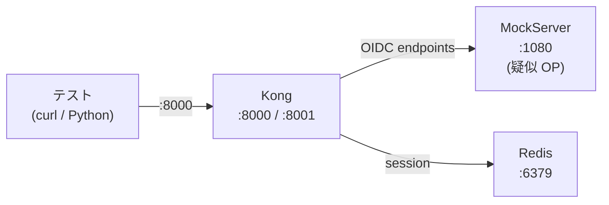

# 統合テスト

Kong + Redis + MockServer（疑似 OIDC Provider）で OIDC プラグインの HTTP レベル動作を検証する。

## テストケース一覧

### Group A: ステートレステスト

| ID | テスト | 検証方法 |
|----|--------|---------|
| A-01 | プラグイン正常ロード | Kong Admin API でプラグイン件数確認 |
| A-02 | 必須フィールド欠落で拒否 | 不正設定で `kong config parse` がエラー終了 |
| A-03 | フィルタパスで認証バイパス | `/test/filtered/health` -> 200 |
| A-04 | セッションなし -> 302 リダイレクト | Location に authorize 含む |
| A-05 | Bearer JWT -> ヘッダー付きプロキシ | 有効 JWT で 200 |
| A-06 | bearer_only + 未認証 -> 401 | WWW-Authenticate ヘッダー付き |
| A-07 | unauth_action=deny -> 401 | リダイレクトなし |
| A-08 | 複数インスタンス -> 最も抑制的なログレベル | Kong ログに `ngx.WARN` 設定記録 |
| A-09 | Redis 停止 -> エラーハンドリング | Redis 停止後も Kong がクラッシュしない |

### Group B: Auth Code フロー完了テスト

| ID | テスト | 検証方法 |
|----|--------|---------|
| B-01 | Redis セッション保存 | Auth Code フロー完了後、Redis にキー存在 |
| B-02 | Cookie サイズ（session ID のみ） | Cookie が 200 バイト未満 |
| B-03 | ヘッダー注入 | X-Access-Token, X-ID-Token が upstream に到達 |
| B-04 | カスタムヘッダーマッピング | header_names/claims 設定 -> 正しいヘッダー |
| B-05 | Cookie 改ざん -> 再認証 | 改ざん Cookie で 302 リダイレクト |
| B-06 | skip_already_auth | credential 未設定時に認証フロー動作 |

## 実行方法

```bash
# 全テスト実行（Docker Compose 起動 -> テスト -> 停止）
bash spec/integration/run-tests.sh

# テストケース一覧のみ表示
bash spec/integration/run-tests.sh --list

# 個別グループ実行（事前に Docker Compose 起動が必要）
docker compose -f spec/integration/docker-compose.test.yml up -d --build
# Kong 起動待ち
timeout 60 bash -c 'until curl -sf http://localhost:8001/status > /dev/null 2>&1; do sleep 2; done'
bash spec/integration/tests/test-group-a.sh
bash spec/integration/tests/test-group-b.sh
docker compose -f spec/integration/docker-compose.test.yml down
```

## 前提条件

- Docker Desktop が稼働していること
- Python 3 + PyJWT + cryptography（Group B のみ）
  ```bash
  pip install PyJWT cryptography requests
  ```
- ポート 8000, 8001, 1080, 6379 が未使用であること

## インフラ構成



## フィクスチャ

| ファイル | 用途 |
|---------|------|
| `fixtures/keys/rsa-{private,public}.pem` | テスト用 RSA 鍵ペア（非運用） |
| `fixtures/jwt/valid-bearer.jwt` | Bearer JWT テスト用トークン（有効期限10年） |
| `fixtures/mockserver/initializerJson.json` | MockServer OIDC エンドポイント設定 |
| `fixtures/kong-test.yml` | Kong 宣言的設定（7ルート） |
| `fixtures/generate-fixtures.py` | フィクスチャ再生成スクリプト（開発者用） |

## 制限事項

- **A-09**: Redis 停止時、Kong はセッション生成のため Redis 接続を待ちタイムアウトする（status=000）。Kong Admin API は応答し続けることで非クラッシュを確認
- **B-06**: `skip_already_auth_requests` の positive テスト（実際にスキップされること）は、別の認証プラグインとの組み合わせが必要で現フィクスチャでは対応しない
- **X-USERINFO**: Auth Code フローでは `session_contents.user = false`（OP の userinfo エンドポイントを呼ばない設計）のため、X-USERINFO ヘッダーは注入されない。これは仕様通りの動作
